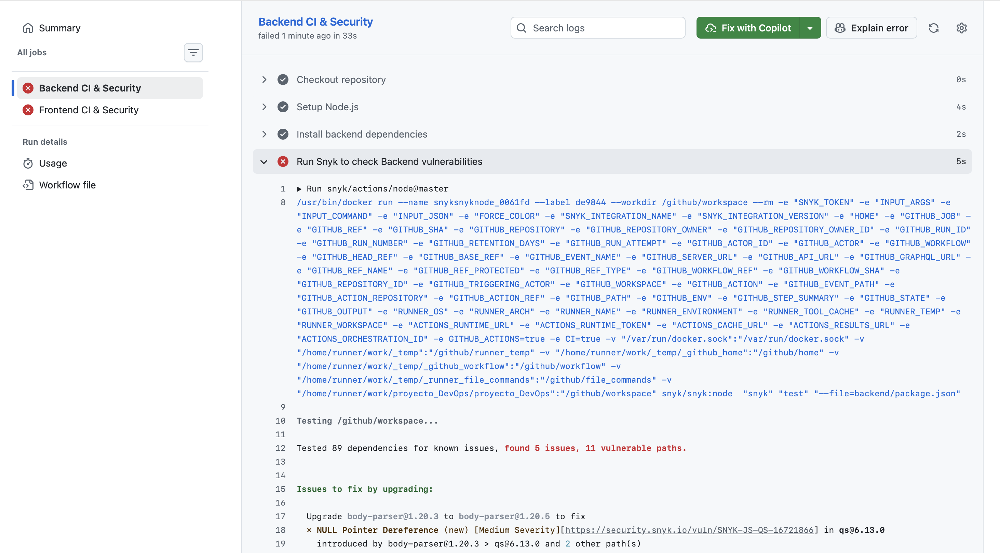
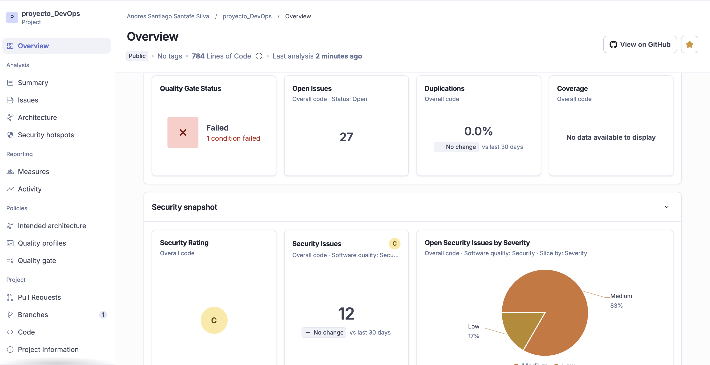
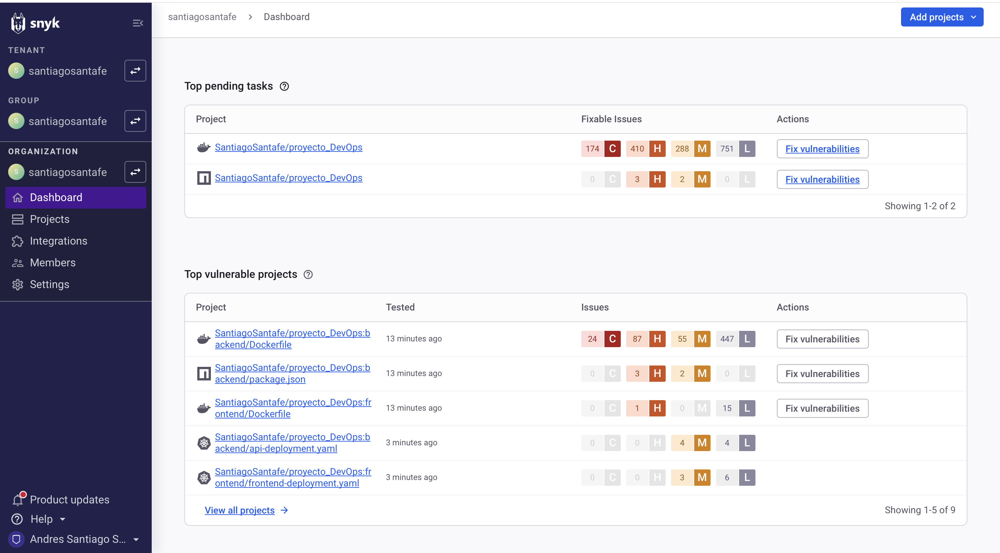
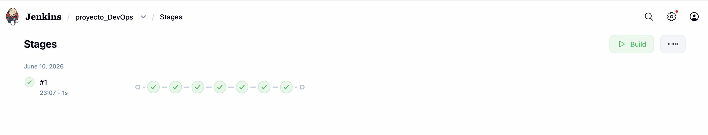
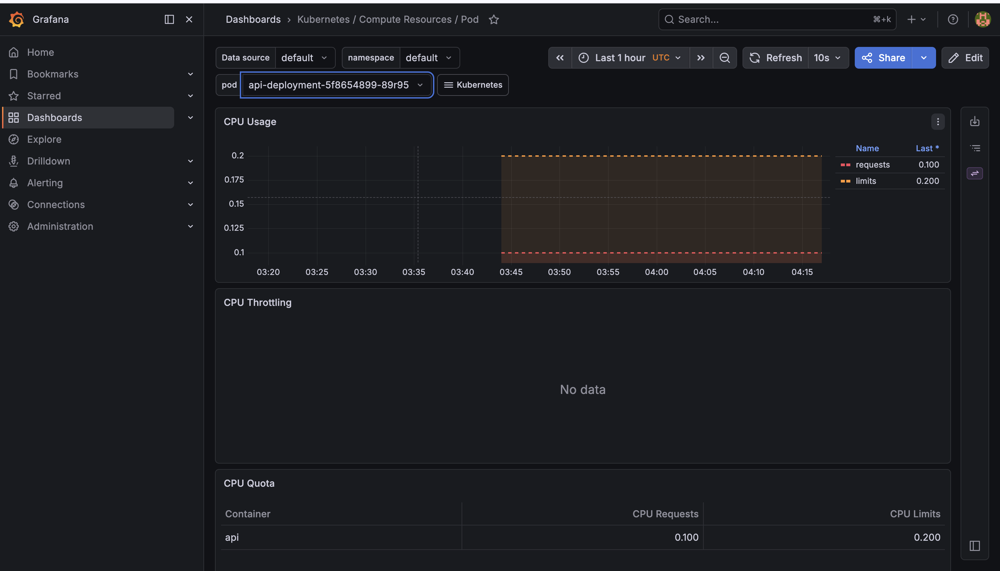

# Proyecto DevOps - Aplicación Web Segura en Kubernetes con Monitoreo Activo
## Valentina Rodriguez y Santiago Santafe

## Descripción del proyecto

Este proyecto corresponde a la entrega final y consolidada del laboratorio técnico de DevOps (Metodología ABP).

El objetivo principal es la implementación de un pipeline CI/CD completamente funcional que integra de extremo a extremo prácticas de seguridad automatizada (**DevSecOps**) y observabilidad en tiempo real (**Monitoreo**), garantizando un ciclo de vida de desarrollo de software eficiente y seguro.

La aplicación está compuesta por:

* **Frontend:** Desarrollado con React y Vite.
* **Backend:** Desarrollado con Node.js y Express.
* **Base de Datos:** MongoDB.
* **Contenedores:** Docker de arquitectura múltiple.
* **Orquestación:** Manifiestos de Kubernetes ejecutados sobre clúster nativo local.
* **Pipeline CI:** Automatizado en GitHub Actions con escaneos de código y dependencias.
* **Pipeline CD:** Definido y orquestado mediante Jenkins en bloques de entrega continua.
* **Monitoreo:** Recolección y visualización de métricas nativas del clúster.


## Tecnologías utilizadas y Justificación

| Tecnología | Uso dentro del proyecto | Justificación Técnica |
| --- | --- | --- |
| **GitHub** | Alojamiento del código fuente | Repositorio centralizado para el control de versiones y disparador de eventos CI. |
| **GitHub Actions** | Automatización de Integración Continua (CI) | Ejecuta flujos de trabajo aislados en la nube ante cada push, optimizando el tiempo de feedback. |
| **Jenkins** | Pipeline de Entrega Continua (CD) | Orquesta de manera flexible las etapas de empaquetado, validación y despliegue local. |
| **SonarCloud** | Análisis Estático de Código (SAST) | Versión SaaS de SonarQube. Evalúa la mantenibilidad, duplicación y encuentra fallos de seguridad sin consumir recursos del clúster. |
| **Snyk** | Escaneo de Dependencias (SCA) | Detecta vulnerabilidades y exploits conocidos en librerías de terceros dentro de los `package.json`. |
| **Docker / DockerHub** | Contenerización y Registro | Empaqueta la aplicación en imágenes portables e inmutables listas para producción. |
| **Kubernetes (OrbStack)** | Orquestación de Contenedores | Entorno de ejecución de alta eficiencia que gestiona el ciclo de vida, escalado y red de los Pods. |
| **Helm** | Gestor de Paquetes para K8s | Permite instalar y versionar arquitecturas complejas (como la pila de monitoreo) con un solo comando. |
| **Prometheus** | Recolección de Métricas | Base de datos de series temporales que extrae automáticamente métricas de estado del clúster. |
| **Grafana** | Visualización de Datos | Panel de control interactivo para monitorizar CPU, memoria y rendimiento general en tiempo real. |

---

## Arquitectura del Flujo CI/CD/SecOps

```text
 [ Código Local ] ──> Push a GitHub ──> [ GitHub Actions (CI) ]
                                                │
                                                ├──> Snyk (Vulnerabilidades)
                                                └──> SonarCloud (Calidad/SAST)
                                                ↓
 [ Jenkins (CD en Localhost) ] <── Poll SCM ── Validado ✔️
        │
        ├──> Build & Push Docker Images (DockerHub)
        └──> Despliegue en Kubernetes (OrbStack) ──> [ Prometheus + Grafana Monitoreo ]

```

---

## Estructura Final del Repositorio

```text
proyecto_DevOps/
│
├── .github/
│   └── workflows/
│       └── ci.yml             # Pipeline de CI (Instalación, Tests, Snyk, SonarCloud)
│
├── backend/
│   ├── Dockerfile
│   ├── server.js
│   ├── package.json
│   ├── ... (manifiestos de Kubernetes para API y MongoDB: deploy, svc, hpa, ingress, pv, pvc)
│
├── frontend/
│   ├── Dockerfile
│   ├── src/
│   ├── ... (manifiestos de Kubernetes para Frontend: deploy, svc, ingress)
│
├── monitoring/
│   └── README.md              # Instrucciones del despliegue del stack de monitoreo Helm
│
├── Jenkinsfile                # Pipeline de CD completamente estructurado
└── README.md

```

---

## Pipeline CI - GitHub Actions (Con Seguridad Integrada)

El pipeline de integración continua (`ci.yml`) automatiza la validación de calidad y la seguridad del código fuente antes de permitir cualquier despliegue.

### Etapas del pipeline CI:

1. **Checkout:** Descarga el código con historial profundo para trazabilidad.
2. **Setup Node.js:** Prepara el entorno de ejecución según la versión del proyecto.
3. **Snyk Security Scan:** Analiza de forma estricta las dependencias en busca de paquetes vulnerables.
4. **Install & Test:** Descarga las dependencias e instala componentes pasando los test unitarios.
5. **SonarCloud Analysis:** Ejecuta el motor de análisis estático buscando malas prácticas y code smells.

---

## Pipeline CD - Jenkins

El archivo `Jenkinsfile` define un pipeline declarativo funcional estructurado en fases limpias y diseñado para entornos operativos de alta disponibilidad:

1. **Checkout Repository:** Sincroniza la última versión del código validado en el CI.
2. **Build Docker Images:** Compila las imágenes del frontend y el backend de forma aislada.
3. **Security Verification:** Valida que las firmas de calidad pasadas en la nube se encuentren aprobadas.
4. **Push to Registry:** Publica las imágenes inmutables etiquetadas en DockerHub.
5. **Deploy to Kubernetes Cluster:** Aplica los manifiestos YAML actualizando los deployments en el clúster.
6. **Verify Prometheus Monitoring:** Certifica que Prometheus descubra los nuevos servicios para iniciar el rastreo.

---

## Evidencias de Ejecución y Resultados

### 1. Evidencias de Integración Continua (CI)

#### Captura del Pipeline Completo de GitHub Actions

Muestra la ejecución exitosa de los Jobs concurrentes de Frontend y Backend.


#### Análisis de Código Estático (SonarCloud)

El proyecto ha sido evaluado en la nube arrojando las métricas de calidad de software correspondientes.


#### Reporte de Vulnerabilidades de Dependencias (Snyk)

Resultados obtenidos directamente del escaneo del gestor de paquetes del proyecto:

```text
Tested 89 dependencies for known issues, found 5 issues, 11 vulnerable paths.
- Mongoose (Severidad Alta): Vulnerabilidad de Inyección detectada en la v8.10.0.
- Express (Severidad Alta/Media): Errores de asignación de recursos sin límites a través de la librería qs.

```


---

### 2. Evidencias de Entrega Continua (CD)

#### Captura del Pipeline de Jenkins (Stage View)

Evidencia visual de la ejecución organizada de todas las etapas operativas del pipeline de CD en bloques verdes secuenciales.


---

### 3. Evidencias de Monitoreo Activo (Grafana)

#### Dashboard de Recursos de Kubernetes (Pods de la Aplicación)

Visualización activa y en tiempo real de las métricas clave extraídas por Prometheus desde el clúster gestionado en OrbStack. Se evidencia el control sobre los límites de CPU y memoria del pod de la API.


---

## Informe de Seguridad y Recomendaciones de Mejora

Basado en los hallazgos críticos reportados por las herramientas integradas en nuestro ecosistema, se determina el siguiente plan de acción inmediato para el equipo de desarrollo:

1. **Mitigación en Base de Datos:** Se requiere actualizar de forma obligatoria la librería `mongoose` de la versión `8.10.0` a la **`8.22.1`** para neutralizar por completo el riesgo de inyecciones de código hacia MongoDB.
2. **Remediación del Servidor HTTP:** Actualizar `express` a la versión **`4.22.2`** y `body-parser` a la **`1.20.5`**. Con esto se mitigan las vulnerabilidades de Denegación de Servicio (DoS y ReDoS) provocadas por el manejo ineficiente de expresiones regulares y asignación de memoria del componente interno `qs`.
3. **Seguridad en Código:** Analizar los 5 *Security Hotspots* indicados por SonarCloud para verificar que no existan credenciales hardcodeadas o configuraciones de CORS expuestas de manera permisiva en el archivo `server.js`.

---

## Reflexión sobre la Eficiencia Operativa

La transición hacia una cultura **DevSecOps** mediante este laboratorio demuestra que la automatización de la seguridad y el monitoreo no añade burocracia, sino velocidad y resiliencia:

* **Seguridad Preventiva (Shift Left):** Al integrar Snyk y SonarCloud en el flujo inicial de GitHub Actions, las vulnerabilidades son interceptadas en la máquina del desarrollador mucho antes de llegar a producción. Esto reduce drásticamente el costo de reparación de fallos.
* **Observabilidad de Negocio:** La integración transparente de Prometheus y Grafana mediante Helm dota al equipo de infraestructura de telemetría en tiempo real. Esto permite realizar escalados automáticos basados en datos (HPA) y detectar fugas de memoria o saturación de CPU antes de que afecten la experiencia del usuario final.
* **Consistencia:** Jenkins elimina el factor del error humano en los despliegues de Kubernetes, garantizando que el entorno productivo sea siempre un reflejo exacto y validado de lo que reside en el repositorio de código.
